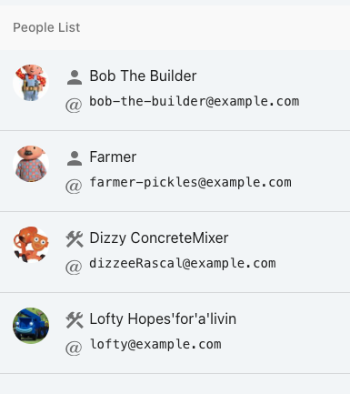

# angle-brackets-demo

This demo showcases angle-bracket invocation and how to use `ember-data-test-selectors`
to build up tests in an ergonomic way that abstracts from the underlying HTML to
focus on functionality.

On running `ember serve` you should be greeted with:

- You can access tests directly after running `ember serve` at [http://localhost:4200/tests](http://localhost:4200/tests)
- Or run the test server directly with `ember test --server` which will be available at [http://localhost:7357](http://localhost:7357)

## Files of interest
Check out the following files for inspiration and implementation details:

- People List Component
  - [app/templates/components/people-list.hbs](./app/templates/components/people-list.hbs)
  - [app/components/people-list.js](./app/components/people-list.js) (just takes in a list of people)
- Tests
  - [tests/integration/components/people-list-test.js](tests/integration/components/people-list-test.js)

## Running / Development

* `ember serve`
* Visit your app at [http://localhost:4200](http://localhost:4200).
* Visit your tests at [http://localhost:4200/tests](http://localhost:4200/tests).

### Running Tests

* `ember test`
* `ember test --server` visit your test server at [http://localhost:7357/](http://localhost:7357/)

## Prerequisites

You will need the following things properly installed on your computer.

* [Git](https://git-scm.com/)
* [Node.js](https://nodejs.org/)
* [Yarn Classic](https://classic.yarnpkg.com/en/docs/install)
* [Ember CLI](https://ember-cli.com/)
* [Google Chrome](https://google.com/chrome/)

## Installation

* `git clone <repository-url>` this repository
* `cd angle-brackets-demo`
* `yarn install --ignore-engines --frozen-lockfile`

